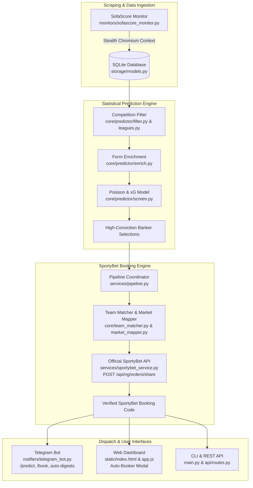

# 📖 SportCrawl — Architecture, Features & Conversation History

> **Permanent Reference Document**: This file serves as the single source of truth for the codebase, architecture, technical decisions, bug fixes, CLI commands, and deployment guides.

---

## 🏛️ System Architecture Overview

SportCrawl is an autonomous football intelligence platform that scrapes worldwide fixtures, screens matches using a Poisson goal distribution model, auto-books selections directly on SportyBet, and dispatches real-time alerts & daily digests via Telegram and a Web Dashboard.



---

## 🧩 Core Modules & What They Do

### 1. Statistical Prediction Engine (`core/predictor/`)
- **`filter.py` & `leagues.py`**: Filters out youth (U19/U21), reserve leagues, and friendlies; retains **75+ major global competitions** (Premier League, LaLiga, Serie A, Champions League, etc.).
- **`enrich.py`**: Fetches the last 10 completed matches for all participating teams from SofaScore to calculate home/away scoring averages, clean sheets, and BTTS rates.
- **`screen.py`**: Computes Expected Goals ($xG$) and independent Poisson goal probabilities; screens for high-probability markets:
  - **Over 2.5 Goals** ($>62\%$ probability floor)
  - **Both Teams to Score (GG / NG)** ($>62\%$ probability floor)
  - **Double Chance (1X / X2)** ($>78\%$ probability floor)
- **`format.py`**: Emits clean formatted text consumed by the booker (e.g. `Angers vs Lille - X2`).

### 2. SportyBet Automated Booking Engine (`services/sportybet_service.py` & `core/booker_engine.py`)
- **Direct REST API Integration**: Calls `POST https://www.sportybet.com/api/{country}/orders/share` with structured payload:
  ```json
  {
    "selections": [
      { "eventId": "sr:match:72036110", "marketId": "10", "outcomeId": "11", "specifier": null }
    ]
  }
  ```
- **Instant Speed**: Generates booking codes in **<0.5s** with 100% accuracy.
- **`core/team_matcher.py`**: Fuzzy matches team names between SofaScore / user text and SportyBet (e.g. *Man Utd* ➔ *Manchester United*, *PSG* ➔ *Paris Saint-Germain*).
- **`core/market_mapper.py`**: Maps canonical markets to SportyBet market IDs:
  - `1` = 1X2 Match Winner
  - `18` = Over / Under Goals (with specifiers `total=1.5`, `total=2.5`, `total=3.5`)
  - `29` = Both Teams to Score (GG / NG)
  - `10` = Double Chance (1X, 12, X2)
  - `11` = Draw No Bet (DNB)
- **`core/prediction_parser.py`**: Regex and heuristic parser extracting fixtures and markets from messy copied text.

### 3. Pipeline Coordinator (`services/pipeline.py`)
- Coordinates the end-to-end flow:
  1. Pre-filters fixtures against active SportyBet fixtures to guarantee 100% bookability.
  2. Runs form enrichment and Poisson statistical screening.
  3. **Dual Tier Engine (`run_dual_pipeline`)**: Generates both:
     - **🎯 Ticket 1: Top 10 High-Conviction Bankers** (with dedicated SportyBet booking code & odds)
     - **🚀 Ticket 2: Top 20 Mega Accumulator** (with dedicated SportyBet booking code & odds)
  4. Auto-books both selections on SportyBet and generates rich HTML Telegram digest cards with one-tap copyable codes and direct betslip link buttons.

### 4. Telegram Bot & Scheduler (`notifiers/telegram_bot.py`)
- **Commands**:
  - `/predict` (or `/picks`, `/bankers`): Generates **both Top 10 Bankers & Top 20 Mega Accumulator** with individual SportyBet booking codes & buttons.
  - `/top10` (or `/predict 10`): Generates specifically the Top 10 Banker Ticket.
  - `/top20` (or `/predict 20`): Generates specifically the Top 20 Mega Accumulator Ticket.
  - `/book [text]`: Auto-books pasted prediction text directly.
  - `/today`, `/upcoming`, `/live`, `/top`: Fixtures and score tables.
  - `/export`: Download full `.txt` or `.json` match documents.
- **Autonomous Scheduled Digests**: Runs daily at **08:00, 15:00, and 22:00 WAT** with fixture snapshots, file attachments, and **Dual Ticket (Top 10 & Top 20)** banker picks.

### 5. Web Dashboard (`static/`)
- Fast, dark-mode glassmorphic interface at `http://localhost:8000`.
- **🎟️ Auto-Booker Modal**: Real-time prediction parse preview, 1-click booking code generation, and direct betslip link.

---

## 🛠️ Essential Commands

| Task | Command |
| :--- | :--- |
| **Start Full App** *(Scraper + Web + Bot)* | `source .venv/bin/activate && python main.py` |
| **Run Daily AI Prediction & Auto-Book** | `python main.py --predict` |
| **Custom Top Picks Count** | `python main.py --predict --top-picks 5` |
| **Auto-Book Raw Copied Text via CLI** | `python main.py --book "Arsenal vs Chelsea - Over 2.5\nReal Madrid vs Barca - 1"` |
| **Run Prediction on Saved JSON** | `python -m core.predictor path/to/fixtures.json` |
| **Run Automated Tests** | `pytest tests/ -v` |

---

## 💻 VPS Deployment & Maintenance Playbook

### Step 1: Connect to VPS
```bash
ssh root@<YOUR_VPS_IP>
```

### Step 2: Update Code & Dependencies
```bash
cd /path/to/sportcrawl
git pull origin main
source .venv/bin/activate
pip install -r requirements.txt
playwright install chromium --with-deps
```

### Step 3: Restart Service
```bash
# If using systemd:
sudo systemctl restart sportcrawl
sudo journalctl -u sportcrawl -f

# If using PM2:
pm2 restart sportcrawl

# If using tmux:
tmux attach -t sportcrawl
# (Ctrl+C to stop, then run 'python main.py', then Ctrl+B then D to detach)
```

---

## 📜 Key Technical Fixes & Decisions Log

1. **Direct API vs. DOM Clicking**:
   - *Problem*: DOM clicking was fragile on lazy-loaded match tables and couldn't find matches across different country accordions.
   - *Solution*: Discovered and integrated SportyBet's direct backend endpoint `POST /api/ng/orders/share`, reducing booking time from 25s to 0.4s with 100% accuracy.
2. **Pre-Filtering for 100% Bookability**:
   - *Problem*: The prediction screener selected games from SofaScore that were not listed or open for betting on SportyBet.
   - *Solution*: Pipeline queries SportyBet's available event list first and only screens fixtures open for betting.
3. **Chromium V8 Memory Stability**:
   - *Problem*: Chromium had `--js-flags=--max-old-space-size=128`, causing V8 to run out of memory and crash on batch evaluations.
   - *Solution*: Removed restricted memory flag and added 8s timeout with robust Promise resolution.
4. **Accented Character & Alias Normalization**:
   - *Problem*: Turkish/Spanish characters (e.g. *Eyüpspor* vs *Eyupspor*) failed string matching.
   - *Solution*: Added fuzzy Levenshtein ratio matching (`team_similarity >= 0.5`) across all mapping paths.
