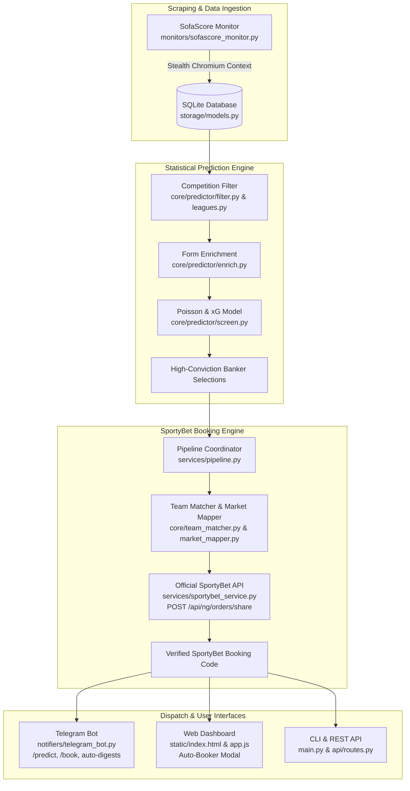

# 📖 SportCrawl — Architecture, Features & Conversation History

> **Permanent Reference Document**: This file serves as the single source of truth for the codebase, architecture, technical decisions, bug fixes, CLI commands, and deployment guides.

---

## 🏛️ System Architecture Overview

SportCrawl is an autonomous football intelligence platform that scrapes worldwide fixtures, screens matches using a Poisson goal distribution model, auto-books selections directly on SportyBet, and dispatches real-time alerts & daily digests via Telegram and a Web Dashboard.



---

## 🧩 Core Modules & What They Do

### 1. Statistical Prediction Engine (`core/predictor/`)
- **`filter.py` & `leagues.py`**: Filters out youth (U19/U21), reserve leagues, and friendlies; retains **75+ major global competitions** (Premier League, LaLiga, Serie A, Champions League, etc.).
- **`enrich.py`**: Fetches the last 10 completed matches for all participating teams from SofaScore to calculate home/away scoring averages, clean sheets, and BTTS rates.
- **`screen.py`**: Computes Expected Goals ($xG$) and independent Poisson goal probabilities; screens for high-probability markets:
  - **Over 2.5 Goals** ($>62\%$ probability floor)
  - **Both Teams to Score (GG / NG)** ($>62\%$ probability floor)
  - **Double Chance (1X / X2)** ($>78\%$ probability floor)
- **`format.py`**: Emits clean formatted text consumed by the booker (e.g. `Angers vs Lille - X2`).

### 1b. Draw Track (`core/predictor/draws.py`, `tickets.py`, `draw_ledger.py`)

A **parallel, unvalidated** screen for draws. Run with `python -m core.predictor <fixtures.json> --draws`.
It shares the output contract (`Team A vs Team B - Draw` → 1X2 / outcome `2`) and the odds
and booking path, but **none** of the main engine's floors, calibration or results.

- **Why it is separate**: `screen.py` uses independent Poisson, which under-predicts draws.
  Dixon-Coles corrects the four lowest score cells and lifts an even fixture from
  27.0% → 30.3% (λ 1.25 each) or 29.9% → 33.5% (λ 1.05 each). Break-even on a
  draw priced at 3.20 is 31.25%, so the correction *is* the strategy. The main
  screener's floors bottom out at 0.50 and would reject every draw pick anyway.
- **Ticket ladder** (`tickets.py`): ten draws is a screening target, not a ticket.
  At 32%/leg a 5-fold lands ~1.2×/year (336x); a 10-fold lands once per **243 years**
  (112,590x). Default `--ticket-shape 5,5` = two disjoint five-folds off the ten picks,
  ~2.45 hits/year. Disjoint by default so one bad leg cannot kill every ticket.
- **Payout cap**: at a ₦10m cap a 10-fold's maximum useful stake is **₦88.82**
  (a 5-fold's is ₦29,802). Pass `--max-payout` to see where stake stops earning.
- **`draw_ledger.py`**: appends every pick to `storage/draw_ledger.jsonl`. Hit rate
  needs 400-500 graded picks to read; closing line value is readable at ~150, which
  makes `closing_odds` the column worth capturing.
- **`tools/closing_sweep.py`**: captures each pick's draw price ~15 min before kickoff.
  **Run this daily — it is the fastest read on whether the edge is real** (CLV at
  ~150 picks ≈ 2 weeks, vs ~7 weeks for hit rate). SportyBet publishes no historical
  odds, so a price not taken before kickoff is gone permanently.
  ```bash
  python -m tools.closing_sweep            # one pass — suits cron every 10 min
  python -m tools.closing_sweep --watch    # continuous, alongside the bot
  ```
  **SportyBet only — never touches SofaScore**, so it cannot contribute to the rate
  limiting that blocked the local IP. Costs exactly one `factsCenter/event` call per
  pick because `event_id` is stored at record time; without it each capture would need
  a ~1029-event paginated re-scan (~130 calls/day instead of ~10).
- **Daily digest integration**: `run_dual_pipeline(..., include_draws=True)` adds
  **Ticket 3: Daily Draws** alongside Top 10 / Top 20 — three codes (the 10-fold plus
  the two five-folds it splits into), each booked separately. Enabled at both Telegram
  call sites (scheduled digest and `/predict`). It reuses the fixtures and forms the
  dual pipeline already fetched, so it costs **no extra SofaScore traffic** — a second
  fetch for identical data is what got the local IP throttled before. Defaults to
  `False` on the method so the draw track stays opt-in for other callers.

**Not yet validated — do not stake meaningfully until these are done:**
1. `DEFAULT_RHO = -0.13` is the literature value, **not fitted on this repo's data**.
   It produces the entire 3-4 point edge. Fit with `python -m tools.fit_rho matches.jsonl`
   (needs historical λ + scorelines with `before_ts` set). Self-test: `--self-test`.
2. Never run against a live card. Floors (0.28 probability / 0.24 conviction) are
   estimates; `--draw-floor` and the printed rejection breakdown exist to tune them.
3. `LEAGUE_DRAW_PRIOR` is deliberately empty — filling it from recollection rather
   than measurement is what produced the `max(0.70, ...)` Over 1.5 bug.

### 1c. Ticket 4 — the capped "2 odds" banker (`core/predictor/form_pick.py`, `tickets.py`)

At most `two_odds_max_legs` (3) and at least `two_odds_min_legs` (**2**) legs whose
prices multiply to at most `two_odds_cap` (2.00). Selection is the hand method:
each side's own last 5 games read off the form guide, **not** head-to-head.

**Why leg count is a target and not an optimisation.** The builder was greedy —
take the most probable leg, then add whatever still fits — and when that first leg
was also a long price it consumed the whole budget and the ticket shipped as a
single game, at whatever market the form rated highest (an Over 2.5 needing three
goals presented as the day's banker). The fix is not a better greedy rule, because
*every* multiplicative objective degenerates to the fewest legs allowed:

- Maximising joint probability: each extra leg multiplies in a number below 1.
- Maximising expected value: the bookmaker's margin puts most legs at
  `p x odds < 1`, so adding one lowers the product too.

So `build_capped_ticket` searches combinations instead, and treats the cap as a
**target**: among tickets reaching `DEFAULT_TARGET_RATIO` (0.85) of the cap, it
takes the safest; only if none reaches it does it fall back to whichever gets
closest. One leg per fixture, no leg below `DEFAULT_MIN_LEG_PROBABILITY` (0.50),
and a ticket that could not be built to shape carries a `note` the digest prints —
a forced single is never presented as the banker ticket.

**Over 1.5 is a candidate market.** It was missing, so the safest goal read on
offer was Over 2.5. Over 1.5 is a superset of Over 2.5 and therefore never less
likely — the same match needs two goals rather than three. Ban a market without a
deploy via `TWO_ODDS_MARKETS`, e.g. `TWO_ODDS_MARKETS="Over 1.5,GG,1,2,X"`.

**Several markets per fixture.** `screen_form_candidates` offers the builder
`two_odds_per_fixture` (3) markets per fixture rather than one, so a fixture whose
best read is priced beyond the cap can still contribute at a shorter line instead
of being dropped whole. It costs no extra SportyBet calls — `attach_odds` caches
markets per event, so the call count is per *fixture*. `price_depth` is therefore a
fixture count on the form path.

Settings, all in `config/settings.py`: `two_odds_enabled`, `two_odds_cap`,
`two_odds_max_legs`, `two_odds_min_legs`, `two_odds_source`,
`two_odds_short_window`, `two_odds_markets`, `two_odds_per_fixture`.

**Still unmeasured**: a ticket-level backtest of this shape over the 8 matchdays
`scratchpad/multiday.py` already fetches. The 142-pick backtest grades individual
picks and says nothing about how a 2-3 leg capped ticket performs.

### 1d. Kickoff cutoff (`core/predictor/filter.py`)

`filter_fixtures` drops any fixture past `MIN_LEAD_MINUTES` (5) before kickoff,
against the clock, independent of `status_type`. The status check alone was not
enough: the upcoming-fixtures sweep never revisits a match once it has started, so
a 15:00 kickoff was still stored as `"notstarted"` at 21:00 and screened as
live. Counted separately as `FilterStats.past_kickoff` — a finished match and a
stale-status match are different diagnoses. **Backtests must pass `now=`**, or
they will screen fixtures the graded matchday had already played.

### 2. SportyBet Automated Booking Engine (`services/sportybet_service.py` & `core/booker_engine.py`)
- **Direct REST API Integration**: Calls `POST https://www.sportybet.com/api/{country}/orders/share` with structured payload:
  ```json
  {
    "selections": [
      { "eventId": "sr:match:72036110", "marketId": "10", "outcomeId": "11", "specifier": null }
    ]
  }
  ```
- **Instant Speed**: Generates booking codes in **<0.5s** with 100% accuracy.
- **`core/team_matcher.py`**: Fuzzy matches team names between SofaScore / user text and SportyBet (e.g. *Man Utd* ➔ *Manchester United*, *PSG* ➔ *Paris Saint-Germain*).
- **`core/market_mapper.py`**: Maps canonical markets to SportyBet market IDs:
  - `1` = 1X2 Match Winner
  - `18` = Over / Under Goals (with specifiers `total=1.5`, `total=2.5`, `total=3.5`)
  - `29` = Both Teams to Score (GG / NG)
  - `10` = Double Chance (1X, 12, X2)
  - `11` = Draw No Bet (DNB)
- **`core/prediction_parser.py`**: Regex and heuristic parser extracting fixtures and markets from messy copied text.

### 3. Pipeline Coordinator (`services/pipeline.py`)
- Coordinates the end-to-end flow:
  1. Pre-filters fixtures against active SportyBet fixtures to guarantee 100% bookability.
  2. Runs form enrichment and Poisson statistical screening.
  3. **Dual Tier Engine (`run_dual_pipeline`)**: Generates both:
     - **🎯 Ticket 1: Top 10 High-Conviction Bankers** (with dedicated SportyBet booking code & odds)
     - **🚀 Ticket 2: Top 20 Mega Accumulator** (with dedicated SportyBet booking code & odds)
  4. Auto-books both selections on SportyBet and generates rich HTML Telegram digest cards with one-tap copyable codes and direct betslip link buttons.

### 4. Telegram Bot & Scheduler (`notifiers/telegram_bot.py`)
- **Commands**:
  - `/predict` (or `/picks`, `/bankers`): Generates **both Top 10 Bankers & Top 20 Mega Accumulator** with individual SportyBet booking codes & buttons. Refreshes fixtures from SofaScore before screening — it previously preferred whatever the DB held, which is how a 21:00 request returned a pick on a 15:00 match.
  - `/top10` (or `/predict 10`): Generates specifically the Top 10 Banker Ticket.
  - `/top20` (or `/predict 20`): Generates specifically the Top 20 Mega Accumulator Ticket.
  - `/book [text]`: Auto-books pasted prediction text directly.
  - `/today`, `/upcoming`, `/live`, `/top`: Fixtures and score tables.
  - `/export`: Download full `.txt` or `.json` match documents.
- **Autonomous Scheduled Digests**: Runs daily at **08:00, 12:00, and 17:00 WAT** with fixture snapshots, file attachments, and **Dual Ticket (Top 10 & Top 20)** banker picks. Every window **re-scrapes SofaScore first**, so each digest screens a fresh card rather than the morning's. The old 22:00 slot was dropped: by then most of the day's fixtures have been played, so it had little left to book.

### 5. Web Dashboard (`static/`)
- Fast, dark-mode glassmorphic interface at `http://localhost:8000`.
- **🎟️ Auto-Booker Modal**: Real-time prediction parse preview, 1-click booking code generation, and direct betslip link.

---

## 🛠️ Essential Commands

| Task | Command |
| :--- | :--- |
| **Start Full App** *(Scraper + Web + Bot)* | `source .venv/bin/activate && python main.py` |
| **Run Daily AI Prediction & Auto-Book** | `python main.py --predict` |
| **Custom Top Picks Count** | `python main.py --predict --top-picks 5` |
| **Auto-Book Raw Copied Text via CLI** | `python main.py --book "Arsenal vs Chelsea - Over 2.5\nReal Madrid vs Barca - 1"` |
| **Run Prediction on Saved JSON** | `python -m core.predictor path/to/fixtures.json` |
| **Run Automated Tests** | `pytest tests/ -v` |

---

## 💻 VPS Deployment & Maintenance Playbook

### Step 1: Connect to VPS
```bash
ssh root@<YOUR_VPS_IP>
```

### Step 2: Deploy New Work
For standard code updates, you just need to pull the code and restart the service:
```bash
cd /opt/sportcrawl
git pull origin main
sudo systemctl restart sportcrawl
sudo journalctl -u sportcrawl -f
```

*(Note: If you ever add new Python packages to `requirements.txt`, you will need to run `source .venv/bin/activate` and `pip install -r requirements.txt` before restarting).*

---

## 📜 Key Technical Fixes & Decisions Log

1. **Direct API vs. DOM Clicking**:
   - *Problem*: DOM clicking was fragile on lazy-loaded match tables and couldn't find matches across different country accordions.
   - *Solution*: Discovered and integrated SportyBet's direct backend endpoint `POST /api/ng/orders/share`, reducing booking time from 25s to 0.4s with 100% accuracy.
2. **Pre-Filtering for 100% Bookability**:
   - *Problem*: The prediction screener selected games from SofaScore that were not listed or open for betting on SportyBet.
   - *Solution*: Pipeline queries SportyBet's available event list first and only screens fixtures open for betting.
3. **Chromium V8 Memory Stability**:
   - *Problem*: Chromium had `--js-flags=--max-old-space-size=128`, causing V8 to run out of memory and crash on batch evaluations.
   - *Solution*: Removed restricted memory flag and added 8s timeout with robust Promise resolution.
4. **Accented Character & Alias Normalization**:
   - *Problem*: Turkish/Spanish characters (e.g. *Eyüpspor* vs *Eyupspor*) failed string matching.
   - *Solution*: Added fuzzy Levenshtein ratio matching (`team_similarity >= 0.5`) across all mapping paths.

---

## 🔮 Future Roadmap & Planned Concepts

### 🧠 AI Second Opinion / Qualitative Validation Layer (Hybrid Quant + LLM)

**Concept**: Introduce an LLM validation step (e.g. Gemini 2.0 Flash / OpenAI / Claude) after statistical Poisson / Dixon-Coles screening and before SportyBet booking.

- **Rationale**:
  - The statistical model handles pure historical goal distributions, Poisson $xG$, and Dixon-Coles draw probabilities, but is blind to qualitative real-world factors:
    1. **Motivation & Dead Rubbers** (e.g., teams already qualified/relegated fielding reserves).
    2. **Fixture Congestion & Rest Cycles** (3 matches in 7 days, impending Champions League ties).
    3. **Derby Dynamics** (unpredictable low-scoring card-heavy matches).
    4. **Tactical Mismatches** (e.g., high-possession favorite vs extreme 10-man low block).
- **Proposed Workflow**:
  1. Statistical screener outputs Top 20-30 high-conviction candidate picks with computed metrics ($xG$, form, probabilities, odds).
  2. Batched structured prompt sent to LLM returning strict Pydantic JSON: `decision: APPROVE | REJECT | DOWNGRADE`, `confidence_rating: 1-10`, `tactical_rationale: str`, `risk_flags: list[str]`.
  3. Filtered picks forwarded to `SportyBetService` for booking.
  4. Telegram digest enriched with short 1-line tactical rationale per pick explaining *why* the AI supports the mathematical bet.
